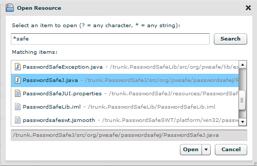



Flower Platform gives you the possibility to open quickly any resource by pressing the CTRL + SHIFT + R (or menu &rarr; Navigate &rarr; Open Resource&hellip;).

This is a very useful feature inspired from Eclipse. The Open Resource dialog helps you even if you don't know the entire name of the resource, but you know only a part of it. Use the * wildcard for this. Or, for camel case named resources, type the capital letters (e.g. PSE would find PasswordSafeException.java).

 
