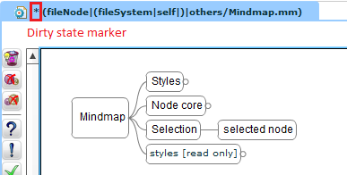
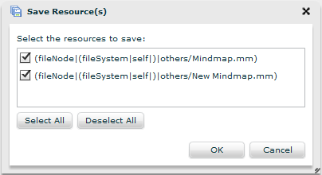



A Flower Platform editor is designed to display:

* file system structures
* text files (*to be implemented*)
* mindmap diagrams
* class diagrams (*to be implemented*)

### Dirty State

An editor is **dirty** if itself or at least one containing resource (e.g. file system case when inner resources are displayed in the same editor) is modified.  
It signals the dirty state (i.e. not saved) with a ``*`` decorator.

### Save & Save All
To save an editor use the application menu bar -> File -> Save (or Save All for saving all the dirty editors).  
If an editor has multiple resources modified, a dialog is displayed allowing you to choose which one to save.

Also you are asked to save modified resources when closing dirty editors or the application's browser tab.

Regarding shortcuts:

* ``CTRL + S`` = Save, but it doesn't work in Internet Explorer. For mysterious reasons, other browsers as well ignore this shortcut from time to time. We fought to find a solution, but no luck. :-(
* ``CTRL + SHIFT + S`` = Save All. This shortcut is more reliable than its little and naughty brother, CTRL + S.

