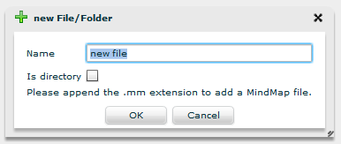



The directory structure can be seen as child of the **fileSystem** node.

## New File/Folder

To create new files and folders, use the **New File/Folder** action.

Insert the desired name, check the **Is directory** checkbox if you want to create a folder, and press **OK**.

## Remove

In order to delete a file/folder, use the **Remove** action.

## Download

When you have finished working with your code on Flower Platform and you're ready to export it back to your local file system, go to the file/directory you wish to download and choose the **Download** action. 

The contents of a directory will be placed in a ``.zip`` file.

The file will be downloaded using your browser's download manager. 

Although Flash Player has no restriction on the size of files you can upload or download, the player officially supports uploads or downloads of up to 100 MB.

## Upload

To upload files from your local file system into Flower Platform, use the **Upload** action.

Only single files are supported. 
To upload multiple files, store them in a ``.zip`` file. Flower Platform will ask you if you want to unzip it.

## Properties

To see additional info about the files, use the **Properties** action.

