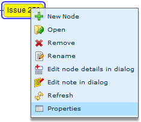
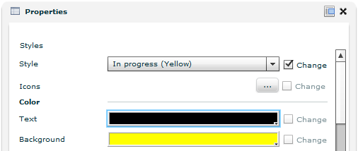
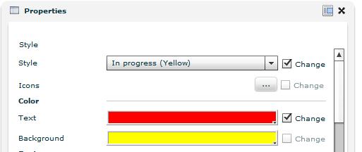



The Properties view displays available properties for the selected node. To enable this view, use the **Properties** action.

Properties that can be edited have a **Change** checkbox next to them. If the default property value is changed, the checkbox becomes selected. Deselecting the checkbox, will restore the default value for that property.

* It is possible to select a different node without leaving the Properties Panel

