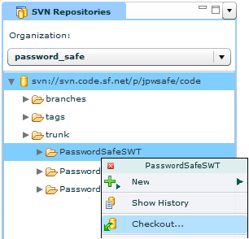



Flower Platform (server) supports the following version control systems:

* [Subversion (SVN)] (http://subversion.apache.org/)
* [Git] (http://git-scm.com/)

The features are similar to the features from the Eclipse IDE (e.g. checkout, commit, update, push, fetch, show history, etc.).
Flower Platform 2.* will have improved ergonomics related to Git support.

<!-- label:ideas -->
* Support for Mercurial.

<!-- label:ideas -->

<strong>Besides</strong> the standard VCS features that are already supported, we think that other kind of features may be added, that <strong>leverage</strong> the integration with the VCSs and add value related to diagram usage: 

<ul>
<li>Support for [GitHub code review] (https://github.com/features/projects/codereview) system (based on comments on diffs between Git commits).</li>
<li>Parse a diff between commits in order to update the current Smart Structure Diagram. E.g. by parsing the diff, Flower Platform will detect new attributes or methods, and will add them automatically on the diagram, colored with red.</li>
</ul>

