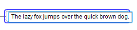
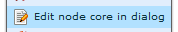
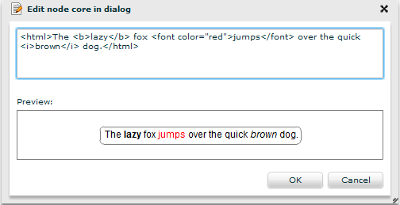



## Edit core in-line

Available at ``mouse click`` or ``F2`` pressed on already selected node.  
Opens an inline editor for fast entering and modifying text.

 

Inline editor hints:

* ``Ctrl + Enter`` -> add new line 
* ``Enter`` or click outside -> submit 
* ``Esc`` -> abort

## Edit core in dialog

Available as action in selected node's menu.

It provides the ability to see changes in real time, necessary when working with html text.

To display html text, enclose it with ``html`` tag.

