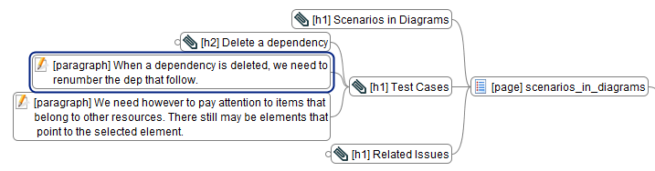



Mindmaps display hierarchical data. And a lot of data that we handle daily can be represented as a hierarchy. I.e. shown as a mindmap.

So mindmaps are a great tool to display data that comes from other (development) tools Flower Platform connects with. E.g. data from wiki (namespaces, articles, heading, etc). Or issues from an issue tracker. Or a website.

E.g. Flower Platform will show us the contents from a wiki page in a mindmap format. When we edit nodes from the mindmap, we are actually adding headings, paragraphs, etc. which will be synchronized with the wiki page:

