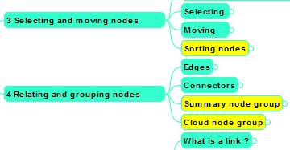



Flower Platform will support mindmap diagrams. 

The first feature set of mindmap diagrams is focused on manipulating classic/generic mindmaps. I.e. create nodes + edit, delete, rearrange, etc. We have as reference the great tools: [FreePlane](http://freeplane.sourceforge.net/) (cf. the screenshot below) and [FreeMind](http://freemind.sourceforge.net).

We love mindmaps because of multiple reasons. 

<ul>
<li>It's somehow between an editor and a diagram.</li> 
<li>It's very fast and keyboard oriented and it's very easy to add content in a natural way (i.e. unorganized ideas, brainstorming ideas, etc.).</li>
<li>Later, the content can be restructured and rearranged easily.</li>
</ul>

