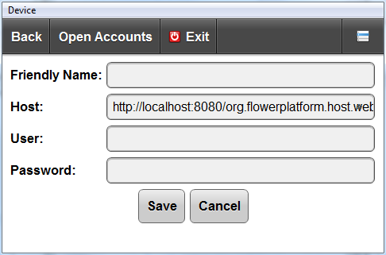
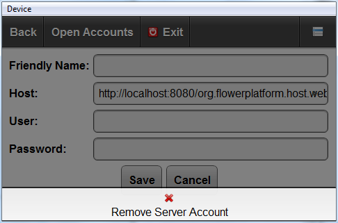



**Edit Server Account** screen is used for editing and deleting existing accounts or adding new ones. It can be opened from the [Server Accounts screen](server_accounts_screen.html) by clicking on the account that needs to be edited or by using the **Add Server Account** action.

## Add Server Account
To add a Server Account, fill the form and click on the **Save** button.

* **Host** field is mandatory.

## Remove Server Account

To delete a server account, use the **Remove Server Account** action.

