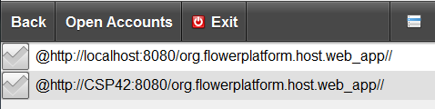
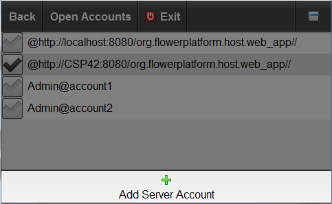


Server accounts screen is used to manage the list of server accounts. It can be opened by clicking on the **Open Accounts** button.

## New Server Account
To create a new Server account, use the **Add Server Account** action.

## Edit Server Account
To edit a server account, click on the account you want to edit, this will open the [Edit Server Account](edit_server_account.html) screen.

## Select Default Server Account
To mark a server account as the default one, the checkbox, next to it, must be selected.
The next time application starts it will connect with the selected default account.

