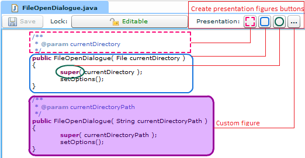
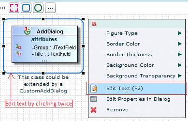



When you collaborate with other users, either if they are in the same room with you, or if you are all in a conf call (e.g. skype), you may want to **back you speech** with some visual aids. We call them presentation figures. They work in every editor (diagram or text).

	 
	<em>Presentation tools on a text editor</em>  
	 
	<em>Presentation figure with additional text, on a diagram</em>

<!-- label:ideas -->

In the current version of Flower Platform, the presentation figures are visible to all the users that view a resource. It may be interesting to create some kind of conferences. 

* A new view, would display the current conference we are in and the other participants. 
* This view may have a chat window, and it may indicate the open tabs of the presenter. 
* When the presenter would open a new resource, or switch tabs, the same action would be done on our screen as well. 
* Our tabs could have different colors: gray/normal color = the presenter doesn't have this tab. Yellow: this tab is also open in presenter's screen. Green: this tab is open in presenter's screen, and is the active one. 