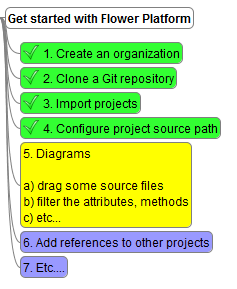



Once the user has seen the demo on live sample data, Flower Platform will display a check list. This check list are the steps that the user needs to do to get started effectively with a certain feature of Flower Platform.

When Flower Platform detects that a step has been completed, the item is automatically checked. Or the user might check steps he would like to skip.  

