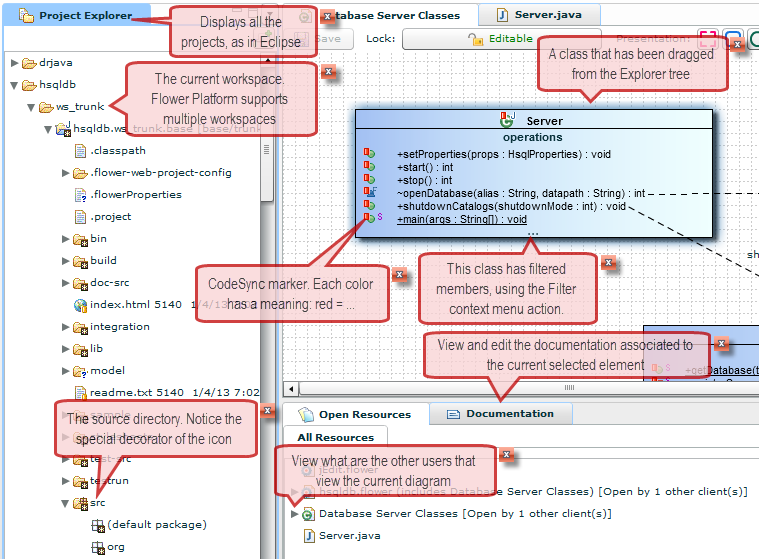



The **purpose of Smart Doc** is to get rid of the documentation for Flower Platform that would be published in a wiki or on a web site.

And to **include** it, in an **interactive** manner, **directly within Flower Platform**.

In the <strong>example</strong> below, a freshly installed Flower Platform:
<ul>
<li>Will contain a project that is properly configured.</li>
<li>Will contain diagrams that use all the diagramming features.</li>
<li>The callouts will be displayed directly within the application. When the user clicks "X", the system will remember and won't show it next time. Of course there will be a setting the re-display a hidden item.</li>
</ul>

This way, a new user will have had very quickly an overview of a certain Flower Platform feature, without leaving the Flower Platform window. And this also applies to experimented users, when a new Flower Platform version is released, with new features.

