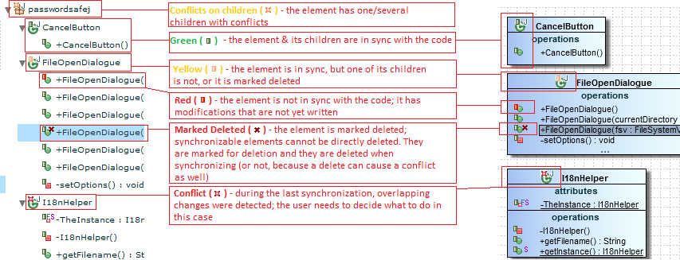



Flower Platform allows you to add on diagrams data from external tools. E.g. source code (classes, attributes, methods, etc.), wiki (namespaces, articles, headings, etc.), issues from issue tracker. The technology that handles the synchronization / round-tripping between Flower Platform and your tools is called **CodeSync**.

At the beginning of Flower Platform, CodeSync worked only for source code. But the concept has been extended, and now several plugins exist for other tools (wiki, issue tracker, etc.). New plugins can easily be created, in order to support a different tool/technology.

This kind of elements (i.e. synchronized from a external tools) have a colored **CodeSync markers** on their icons. The markers indicates the current synchronization status. The image below, shows some **CodeSync markers** on source code: left - the explorer tree, right - on diagrams. 

