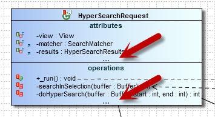
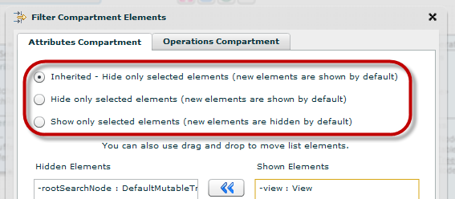



The child elements (e.g. attributes, methods) of elements from diagrams (e.g. class) can be filtered. A "..." is shown at the bottom of the compartment.

## Strategy for New Elements

What's interesting is what happens with the filtered compartments, once **new elements are added** (e.g. an attribute). There are 2 strategies:

* when new items are added, they will be automatically shown on the diagram
* OR, when the new item is added, they will be hidden

The filter dialog allows us to chose the proper strategy:

The <strong>most used strategy</strong> is the second one; i.e. when a new item is added, it won't be shown. 
Usually people use filtering because only a subset of the item from a diagram (e.g. only selected attributes, methods) participate to the feature/scenario/flow depicted in a diagram. When they will enrich the item (e.g. class) with new elements (e.g. attribute, method), these new elements probably don't participate to the current feature/scenario/flow depicted in a diagram, so automatically adding them on the current diagram is something that people don't want.

The strategy for new elements is based on the styles infrastructure of Flower Platform. Hence the "Inherited" option from the dialog above. 
You can set the style you want on diagram level (i.e. all items from the diagram will have the desired behavior), globally or per style class. 
