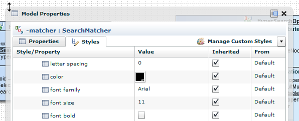



The visual appearance of the diagram elements can be customized.

A CSS-like style inheritance mechanism exists. E.g. you can set the color of attributes at diagram level, and all attributes on that diagram will have that color.

<!-- label:in-progress -->
Flower Platform will support style classes, similar to CSS. There will be 2 types of style classes: user defined, and "internal"/system classes, applied automatically by Flower Platform based on the type and state of the current element. E.g. an abstract item has italic font; a static item is underlined; a class title is centered and bold. You will be able to alter these kind of "internal"/system classes as well.   

<!-- label:ideas -->
UI: The current style mechanism uses a table that displays all the available styles (and properties). We'd like to have a window that shows the most common styles (and properties), with a custom xy layout (i.e. not within a table). This way, it will be faster to modify them (e.g. font color, background color, font size, etc.). We should keep the current system as well, for the case when we want to modify an advanced item (e.g. letter spacing, gradient type, etc) and/or see the inheritance of styles.