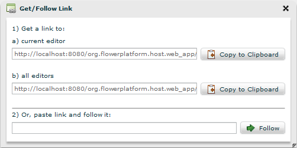

For a better collaboration between users, we provide links to each editor.  
Use the **Navigate -> Get/Follow Link** action to access them.

To follow a link, just copy it in corresponding text input and the Follow button will interpret it in the same Flower Platform application.

