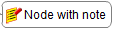



## Edit core in-line

Available at ``mouse click`` or ``F2`` pressed on already selected node.  
Opens an inline editor for fast entering and modifying text.

 

Inline editor hints:

* ``Ctrl + Enter`` -> add new line 
* ``Enter`` or click outside -> submit 
* ``Esc`` -> abort

## Edit core in dialog

Available as action in selected node's menu.

It provides the ability to see changes in real time, necessary when working with html text.

To display html text, enclose it with ``html`` tag.

## Edit node details in dialog

Available as action in selected node's menu.

It provides the ability to add **Node details**. 

To display html text, enclose it with ``html`` tag.

**Node details** can be expanded or collapsed by clicking on the **Note Details Icon**.

## Edit note in dialog

Available as action in selected node's menu.

It provides the ability to add **Node notes**.

To display html text, enclose it with ``html`` tag.

Nodes that have notes are preceded with a **note icon**.
**Node note** is visible when the mouse pointer is moved over the node.

