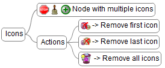
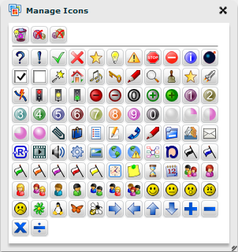
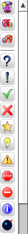
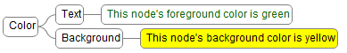
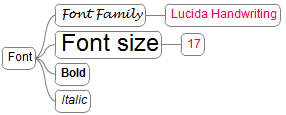
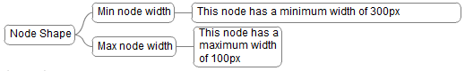
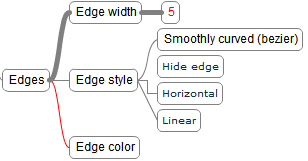
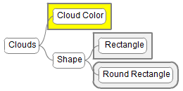



We are inspiring our node properties and styles from [Freeplane](http://freeplane.sourceforge.net).
We currently support a subset of Freeplane's properties and styles. 

A property can be changed by using our [Properties Editor](../core/properties_editor.html).

## Style

We can attach one style to a node by selecting the style name(s) from a list of predefined and user defined styles.

[Manage Styles](manage_styles.html)

## Icons

The selected icon from list will be added to selected node(s).

We provide 2 ways to change a node's icons:

1. using the Icons property from Properties Editor
2. using the icons sidebar

## Color

* **Text** - foreground color (the color is applied to all text)
* **Background** - background color (the color is applied to the entire node)

## Font

* **Font Family**
* **Size** 
* **Bold** 
* **Italic** 

## Node Shape

* **Min node width** (in pixels)
* **Max node width** (in pixels)

## Edges

* **Edge width** (in pixels)
* **Edge style**
* **Edge color**

## Clouds

* **Cloud Color** - background cloud color 
* **Cloud Shape** - cloud form (Rectangle and Round Rectangle forms are supported).

