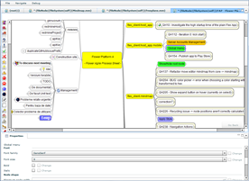



Flower Platform stores all the data in a tree. The Mind Map Extension displays this data as nodes in a mind map.

The Mind Map Extension has 2 main responsibilities:

### 1) Display generic data as mind map nodes

And nothing more. I.e. other extensions will add functionality for aspects like: 

* how the nodes are actually rendered (e.g. what colors, styles, etc.), 
* what kind of interactions are possible (e.g. what actions? Can nodes be added, edited? What kind of relations can be added? Etc.),
* how the nodes are actually synchronized with external data (e.g. a node of type "javaClass" with an actual Java source file).

### 2) Collaborate in real time on [Freeplane](http://freeplane.sourceforge.net/) (or [FreeMind](http://freemind.sourceforge.net)) mind maps: on the web & mobile 

[Freeplane](http://freeplane.sourceforge.net/) and [FreeMind](http://freemind.sourceforge.net) are great open-source mind mapping software. The Mind Map Extension acts like a bridge between them and Flower Platform.

I.e. we can see within Flower Platform, mind maps persisted in ``.mm`` files. And this way, we can access (and edit) mind maps from web browsers and from mobile environments. And we can collaborate in real time on mind maps. 

*Note*: The Flower Platform editor supports a subset of the features provided by the actual desktop apps (Freeplane, FreeMind). The exhaustive set of features is described here, on our web site. However, the Flower Platform team works actively to support more an more graphical features, in order to offer an user experience very similar to the one offered by the desktop apps.

