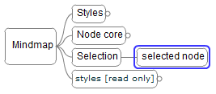



A node is considered selected when it's highlighted by a blue selection rectangle.

To **select** a node just click on it or use the shortcuts mentioned further in this page.

To **un-select** a selected node(s), click outside the node, in an empty place or click on an other node, which wil be selected next.

Keep ``Shift`` pressed if you want to append selected node to current selection.  
Keep ``Ctrl`` pressed if you want to remove a selected node from current selection, 
