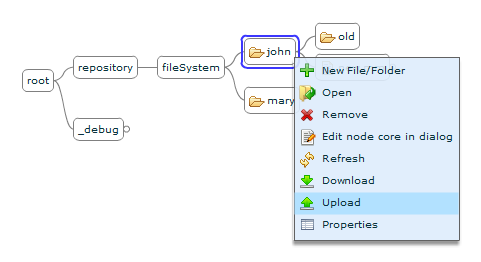
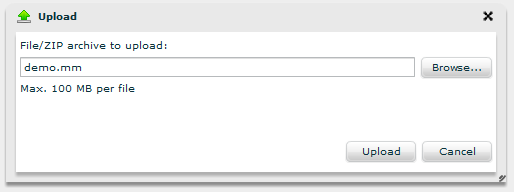
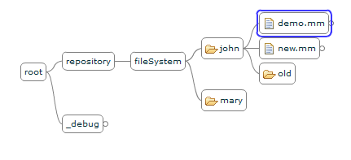
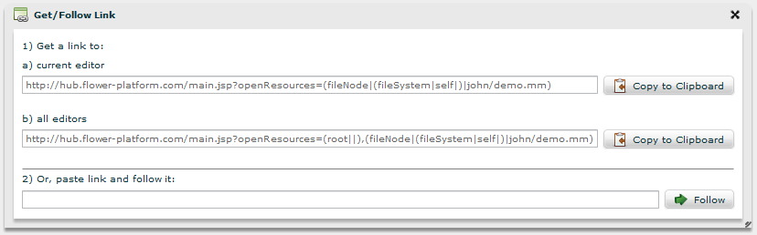
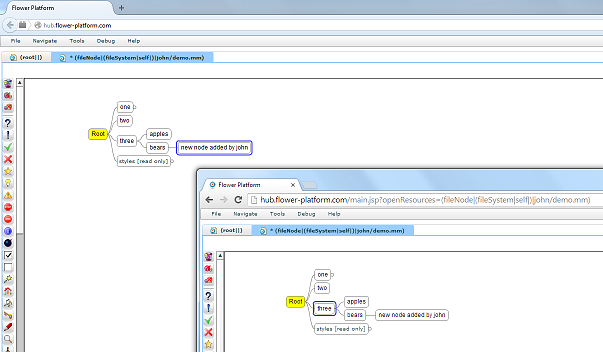
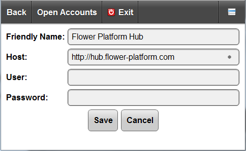
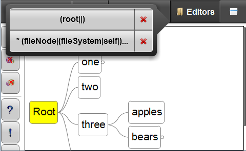



# Desktop Application

Go to [Flower Platform Hub](http://hub.flower-platform.com/).

The first thing you'll notice should be the ``root`` editor that is already open when the application is loaded. There is a ``repository`` node, containing data about the existing repository on the server, and a ``_debug`` node, containing data about the active sessions and open resources, as well as the state of the registered node controllers.

Navigate to the ``repository`` node. The ``fileSystem`` node displays the directories and files on the file system.

Create a directory with your name, using the **New File/Folder** action on the ``fileSystem`` node. This will be your playground.

More details on working with the file system are available in [the file system section](/concepts/core/#FileSystem).

### Upload your mind maps

You can upload an existing mind map file from your local file system to FP Hub's file system, using the **Upload** action on your directory. The file will appear as a child node of the directory node, and can be opened right away.

Of course, you can also create a new mind map from scratch, using the **New File/Folder** action. Make sure to append the ``.mm`` extension; this way the file will be treated as a mind map and opened in the corresponding editor.

Now that you have a mind map, you can view it, edit nodes and save your work, almost as if you were working with the Freeplane desktop application.

To see what's available for the mind map editor, visit [the mind map section](/concepts/mind-map). Working with editors in general is detailed in [the editor section](/concepts/core/#Editor).

### Share your mind maps

You can easily share your work with others; any modification you make on your mind map will be automatically propagated to any other user who has the file open in an editor.

To invite others to a collaborative work session on one (or more!) of your mind maps, go to the **Navigate > Get/Follow Link** action in the global menu. We provide a link to the currently active editor, as well as to all the editors you have open.

The link may be pasted in the browser's address bar. In this case the editor(s) will be opened as soon as the application is loaded. If you already have the FP Hub open in your browser, you can also paste the link the **Follow** text input in the **Get/Follow Link** dialog to open the editors in the same application.

### Download your mind maps

After saving your files, you may download them with the **Download** action in the context menu. Download individual files, or your entire directory, in which case the contents of the directory will be packed as a ``.zip`` file.

# Mobile Application

Download the mobile application from the Google Play Store: LINK ???

The app is automatically configured to connect to the Flower Platform Hub. [The mobile section](/concepts/mobile/#ServerAccountsscreen) details the server accounts management.

Same as with the desktop application, the ``root`` editor is already opened. Navigate to the ``fileSystem`` node and set up your playground as recommended above, or go to an existing directory. On the mobile app, global and contextual actions can be run from the menu button.

Since the mobile application was specifically designed as a quick way to view and edit mind maps when you don't have access to your desktop computer or laptop, downloading and uploading files is not available. Existing mind maps can be opened, edited and saved, and new mind maps may be created.

You may open as many editors as you'd like. To switch between editors or close an editor, tap the **Editors** button. This will display a callout component that contains the opened editors.

