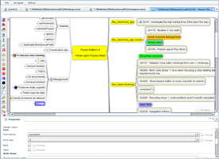



  

	
	
Smart* mind maps and diagrams for developers

	<small>* <i>smart</i>: see paragraph below for our definition</small>
  

<h1>What? <small>What is Flower Platform?</small></h1>

Flower Platform is an **open source** (GPL v3) software platform designed to help developers to represent data as **smart mind maps** and **diagrams**. We say that mind maps and diagrams are smart when:

<button type="button" class="btn btn-primary btn-s" data-toggle="collapse" data-target="#what-details">
More 
</button>

1. they show data that comes from **external data sources** (e.g. from source code, development tools, etc.);
1. they allow us (developers) to **interact visually** with the data. And when done, the modifications are synchronized with the original data sources (i.e. 2 way data synchronization);
1. they allow simultaneous **collaboration** between us. **Ubiquity**: access and collaborate on mind maps and diagrams from the web, IDE, mobile.

Flower Platform has several **components**:

* *Flower Platform Core*
  * *Flower Platform Web App*: a server application (with a web front-end); it hosts extensions (plugins)
  * *Flower Platform Mobile*: a mobile client for the Flower Platform Server
  * *Flower Platform for IDE*: hosts extensions (plugins) inside popular IDEs
* *Flower Platform Extensions*: plugins that do the actual work
* *Flower Platform Hub*: an online free service: cloud hosted Flower Platform Server and extensions

<h1>Why? <small>Why do we think it's important? Why are we developing Flower Platform?</small></h1>

Because of **best practices**:

<button type="button" class="btn btn-primary btn-s" data-toggle="collapse" data-target="#why-details">
More 
</button>

* Best practices recommend us (developers) to use various modern libraries and frameworks. This helps us at **runtime**. 
* Best practices advocate the use of various tools, techniques, development methods, etc. This boosts our productivity by improving our **work flow**.

The state of the art in our field of work (i.e. the number and quality of programming languages, libraries, frameworks, IDEs, development tools, etc.) is **awesome**. But we (the Flower Platform dev team) think that things can be "MOAR" awesome, if we had an intelligent tool that would:

* automatize our work with libs, frameworks, etc. (i.e. the **runtime** area), and
* interconnect some dev tools that we are using (i.e. the **work flow** area).

# How? <small>Overview of Flower Platform components</small>

# Flower Platform Core

**Flower Platform Core** is a modular platform that makes it easy for extensions to connect to external data sources, to represent data visually and to synchronize the data. It contains:

## Flower Platform Web App

Sharing and collaboration around mind maps and diagrams are a primary focus. 

The server side code is written in Java and it's modular, packed as [OSGi plugins](http://www.osgi.org) (in an [Eclipse Equinox](http://www.eclipse.org/equinox/) container). 

The client side code (using [Apache Flex](http://flex.apache.org/) and JavaScript) is also modular.

<a class="btn btn-default" href="extensions/core" role="button">More &raquo;</a>

## Flower Platform Mobile 

A mobile client for Android and iOS.

The platform makes it easy for extensions to expose most of their features on mobile,  using **single sourcing** (i.e. same client code runs in the web and mobile environment). 

The client side code (using [Apache Flex](http://flex.apache.org/) and JavaScript) runs on mobile using the [Adobe AIR](http://www.adobe.com/products/air.html) technology.

<a class="btn btn-default" href="extensions/mobile" role="button">More &raquo;</a>

## Flower Platform for IDE

Designed to integrate into IDEs, using an embedded servlet container ([Jetty](http://www.eclipse.org/jetty/)), and an embedded browser. 

[Eclipse](http://www.eclipse.org) is supported natively (being an OSGi container). 

[IntelliJ IDEA](http://www.jetbrains.com/idea/) and other IDEA based IDEs are supported as well, using a small Equinox based host wrapper. The same principle can be used to easily support other IDEs in the future. 

Same **single sourcing** concept applies here as well (i.e. same server and client code runs both in a web deployment or in a IDE/local deployment).

# Flower Platform Extensions

An **extension** is a set of OSGi plugins that do the actual work. I.e. they know how to connect to external data sources, they know how to represent it visually, and they know how to synchronize it. Of course, extensions leverage the convenient API exposed by Flower Platform Core (e.g. diagramming library, data synchronization algorithms, etc.). This way, with **single sourcing**, the same plugin code runs in the web app, the IDE and mobile/tablet.

## Mind Map

Display generic data as mind map nodes

Collaborate in real time on [Freeplane](http://freeplane.sourceforge.net/) (or [FreeMind](http://freemind.sourceforge.net)) mind maps: on the web & mobile 

<a class="btn btn-default" href="extensions/mind-map" role="button">More &raquo;</a>

## More Extensions

Several extensions are under active development. 

They should be released in a couple of month. They are interesting and really add value to developers!

# Flower Platform Hub

**Flower Platform Hub** is an online free service: the Flower Platform ecosystem, in a cloud based environment. Users have the access to all the features of the Flower Platform & extensions, without having to install and maintain a Flower Platform server. Flower Platform Hub is meant to be used by open source communities.

<h1>History <small>Important historical milestones of Flower Platform</small></h1>

<button type="button" class="btn btn-primary btn-s" data-toggle="collapse" data-target="#history-details">
More 
</button>

### Flower Platform v1: UML4AS - UML editor with code synchronization support for ActionScript and Flex

* May 22, 2010: Crispico releases UML4AS, UML for ActionScript & Flex. An Eclipse plugin focused on UML modeling. It features a technology that we call CodeSync, a code <-> model synchronization technology that militates for a modeling language that supports language specificities. The frontend of UML4AS is web based, so the Eclipse editor embeds actually a web browser showing the UI.
* January 13, 2011: UML4AS 1.2 is released. 
* August 29, 2011: UML4AS has reached 10k downloads.
* December 15, 2011: UML4AS + Java is released. Same product with code synchronization support for Java.

### Flower Platform v2: Flower Dev Center - Collaborative diagramming software (web based)

* October 23, 2012: Crispico releases Flower Dev Center. A server product with web UI that features diagramming and code synchronization.

### Flower Platform v3: Smart diagrams that connect to your code & dev tools

* March 11, 2013: Crispico starts working at Flower Platform v3. A rewrite of the existing products, having as goals: mobile support, multiple programming languages & dev tools support. And ultimate performance. Flower Platform becomes open-source.

### Flower Platform v4: Smart mind maps and diagrams for developers

* December 2, 2013: Crispico decides once again to perform a major rewrite, because of 2 main resons:
  * Scalability. For Flower Platform <= v3, we were managing and persisting data with [Eclipse EMF](https://www.eclipse.org/modeling/emf/). EMF is a great technology, that offers a lot of features. But, from our experience, when we need to scale, and persist data in a data store (SQL or NoSQL), things begin to be complex. And the amount of complexity > the comfort offered by the EMF framework. That's why, we decided to abandon EMF, in favour of an in-house implementation, more light-weight and scalable.
  * Slight strategy shift. We decided to focus more on representing data as mind maps rather than diagrams. We find that mind maps are somehow between a text editor (rather key oriented) and a diagram (rather mouse oriented) and they offer better productivity for developers.

<!-- .content -->

<!-- .container -->
